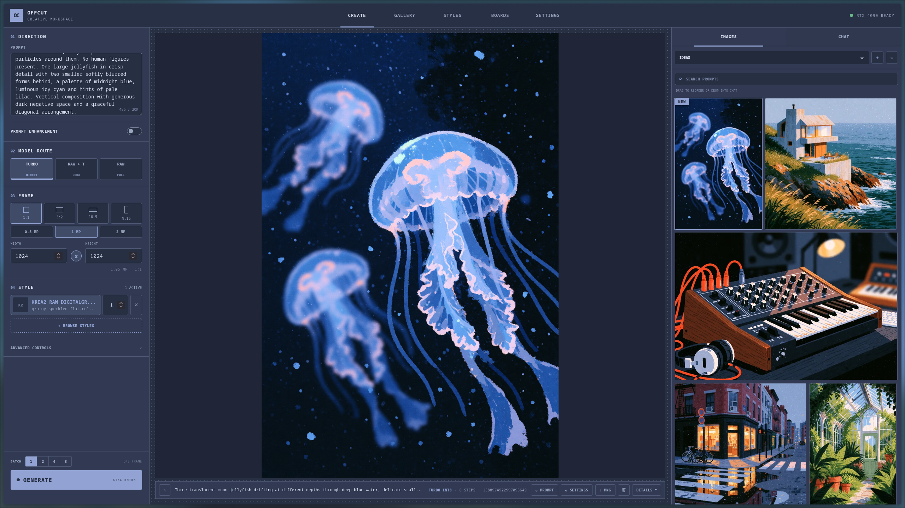
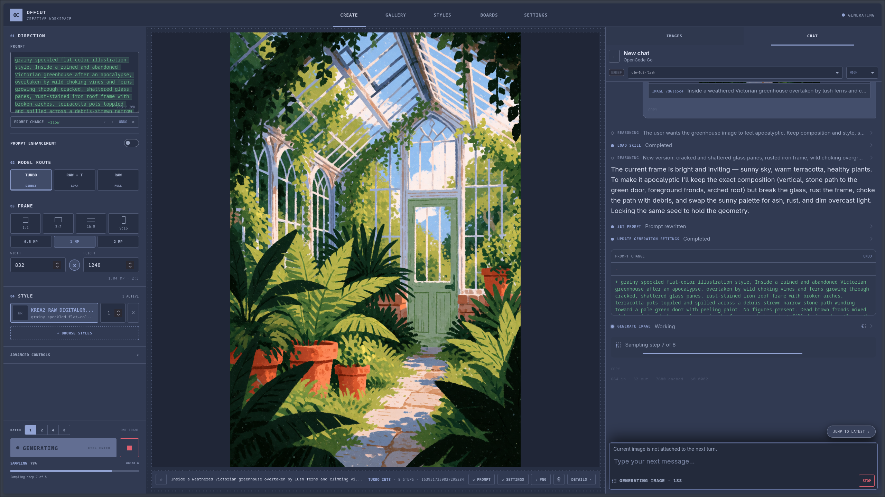
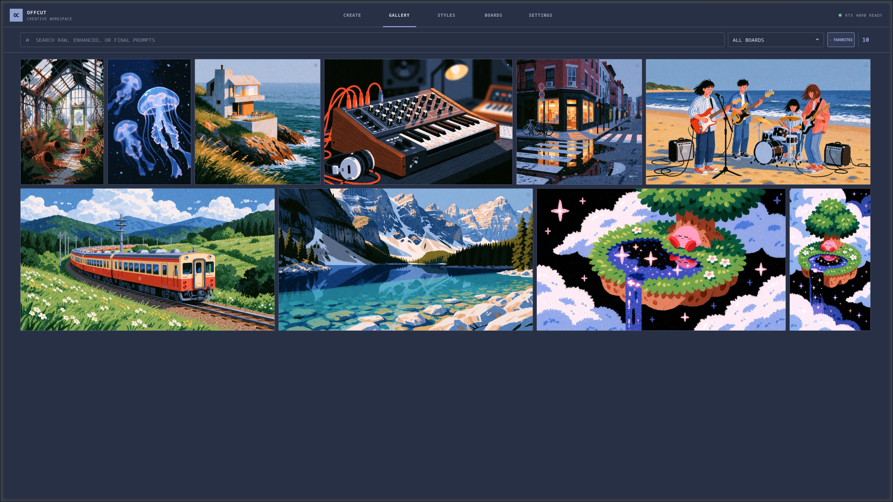

# Offcut

My own AI workspace, built because I don't really enjoy working in ComfyUI's node editor. It's mainly for me, but feel free to use it, take inspiration, or open a request. I'll take a look when I can.

It currently generates images with Krea 2 using ComfyUI under the hood. You don't need to run ComfyUI's server or use its editor.

## Screenshots



<details>
<summary>Chat and gallery</summary>





</details>

## Setup

You'll need **Linux, Python 3.12, Git, Node.js 22.19+ and npm**. Tested on an **RTX 4090 (24 GB)**; **AMD RX 7900 XTX support is experimental and untested**. Allow about **19 GB for models**, plus dependencies and images.

Run these commands from the Offcut repository. The default setup expects a ComfyUI checkout beside it, with Python at `../ComfyUI/.venv/bin/python`.

<details>
<summary>Install ComfyUI and GPU dependencies</summary>

```bash
git clone https://github.com/Comfy-Org/ComfyUI.git ../ComfyUI
git -C ../ComfyUI checkout 9a9fdb10ed144ce760d9682cb247526ea23cc525
python3.12 -m venv ../ComfyUI/.venv
```

Install PyTorch for **one** GPU type:

**NVIDIA** — with a working NVIDIA driver:

```bash
../ComfyUI/.venv/bin/python -m pip install torch==2.11.0 torchvision==0.26.0 torchaudio==2.11.0 --index-url https://download.pytorch.org/whl/cu128
```

**AMD RX 7900 XTX** — first install the [ROCm 7.2 driver for your Linux distribution](https://rocm.docs.amd.com/projects/radeon-ryzen/en/docs-7.2/docs/install/installrad/native_linux/install-radeon.html), then use the [ROCm PyTorch wheels](https://pytorch.org/get-started/previous-versions/#v2110):

```bash
../ComfyUI/.venv/bin/python -m pip install torch==2.11.0 torchvision==0.26.0 torchaudio==2.11.0 --index-url https://download.pytorch.org/whl/rocm7.2
../ComfyUI/.venv/bin/python -c 'import torch; print("ROCm:", torch.version.hip); print("GPU available:", torch.cuda.is_available())'
```

The check should print a ROCm version and `GPU available: True`. Offcut detects ROCm automatically and uses PyTorch quantization kernels instead of Triton. This may be slower; start with a single 512×512 Turbo image. Full generation still needs testing on the card. These instructions target native Linux.

Then, for either GPU:

```bash
../ComfyUI/.venv/bin/python -m pip install -r ../ComfyUI/requirements.txt
```

The pinned ComfyUI revision is the one used here. Other revisions need Krea 2 support and may require adjustments.

</details>

<details>
<summary>My ComfyUI installation is somewhere else</summary>

```bash
export OFFCUT_COMFY_ROOT="/path/to/ComfyUI"
export OFFCUT_PYTHON="$OFFCUT_COMFY_ROOT/.venv/bin/python"
./offcut-cli settings set comfy_root "$OFFCUT_COMFY_ROOT"
```

`OFFCUT_PYTHON` selects the interpreter; saved settings select the ComfyUI folder. Use `./offcut-cli settings show` to check your paths.

</details>

**1. Install the app dependency and download the raw model and Turbo LoRA.**

```bash
"${OFFCUT_PYTHON:-../ComfyUI/.venv/bin/python}" -m pip install -r requirements.txt
./offcut-cli download raw-int8 turbo-lora
```

Download these separately into your ComfyUI folder:

| File | Put it in |
| --- | --- |
| [qwen3vl_4b_fp8_scaled.safetensors](https://huggingface.co/Comfy-Org/Krea-2/resolve/main/text_encoders/qwen3vl_4b_fp8_scaled.safetensors) | `models/text_encoders/` |
| [qwen_image_vae.safetensors](https://huggingface.co/Comfy-Org/Krea-2/resolve/main/vae/qwen_image_vae.safetensors) | `models/vae/` |

**2. Check the files and launch.**

```bash
./offcut-cli models
./offcut
```

Open **http://127.0.0.1:7862**. The first launch installs the Node dependencies automatically.

## Using it

- **Create** generates images; boards and the gallery keep them organized.
- **Styles** combines LoRAs with saved prompt recipes. Put Krea 2-compatible `.safetensors` files in `models/loras/`, refresh the library, and edit their triggers and strength there.
- **Chat** can write prompts, generate, and compare images. Add a provider connection in Settings to use it.

Generation stays on your GPU. Optional chat and enhancement send prompts and supplied images to your chosen provider. By default, the app only listens on your own computer.

### Access from your local network

To open the UI from another computer or phone on your network, launch it with:

```bash
./offcut --host 0.0.0.0
```

On the other device, open `http://<your-computer's-LAN-IP>:7862` (for example,
`http://192.168.1.50:7862`). You can also bind a specific address with
`./offcut --host 192.168.1.50`, or choose a port with `--port 8080`.
This shares the same workspace and GPU controls with devices that can reach it; there is no login.

### Generation routes

The raw model and Turbo LoRA support all three routes:

| Route | How it works |
| --- | --- |
| **Turbo** | Fast default: 8 steps with the Turbo LoRA. |
| **Raw → Turbo** | Starts with Raw, then finishes with Turbo. At the default 1024×1024 size, 4 Raw steps → 11 Turbo steps. |
| **Raw** | A full 52-step Raw pass, with adjustable guidance and negative prompting. |

Raw → Turbo's Advanced controls let you choose **Raw steps**, with a live readout such as
**4 Raw steps → 11 Turbo steps**. The Turbo count updates automatically for the current frame size.
The collapsed **Sampling setup** section holds the full-pass counts (Raw 52 / Turbo 12); leave
those at their defaults for normal use. Guidance and negative prompts affect only the Raw stage;
style LoRAs apply to both. More Raw steps takes longer and can change the composition.

Chat understands the same controls: ask it to “try 9 Raw steps” or change the settings without
generating. Cover recipes also use the same step controls.

<details>
<summary>Command-line use</summary>

```bash
./offcut-cli generate "A red fox in fresh snow" --seed 42
./offcut-cli generate "A red fox in fresh snow" --preset raw-int8-to-turbo --raw-portion 8 --raw-steps 52 --steps 12 --guidance 3 --seed 42
./offcut-cli generate "A red fox in fresh snow" --preset raw-int8 --seed 42
./offcut-cli --help
```

CLI presets are `raw-int8-turbo-lora` (Turbo, the default), `raw-int8-to-turbo` (Raw → Turbo),
and `raw-int8` (Raw).

For Raw → Turbo, `--raw-portion` chooses the percentage handoff on the Raw schedule,
`--raw-steps` sets the Raw full-pass count, and `--steps` sets the Turbo full-pass count.
Only the beginning of Raw and the remaining part of Turbo execute. Guidance is CFG minus one;
the hybrid default of `--guidance 3` means CFG 4 during the Raw stage. Turbo finishes at CFG 1.

The CLI doesn't need Node.

</details>

## Updating

Stop the app, then:

```bash
git pull
"${OFFCUT_PYTHON:-../ComfyUI/.venv/bin/python}" -m pip install -r requirements.txt
npm --prefix agent ci
./offcut
```

Your workspace stays local and is excluded from Git. Back it up separately. Generated PNGs include their prompts and settings.

<details>
<summary>Where things are saved</summary>

| Data | Location |
| --- | --- |
| Settings | `~/.config/offcut/settings.json` |
| Boards, chats and styles | `data/offcut.sqlite3` |
| Provider keys | `data/offcut.secrets.json` |
| Models / images | `models/` / `outputs/` |

Override the first three with `OFFCUT_CONFIG`, `OFFCUT_DATABASE`, and `OFFCUT_SECRETS`. Change `model_dir` and `output_dir` through `./offcut-cli settings set`.

</details>

## License

Copyright (C) 2026 Offcut contributors. [GPL-3.0-only](LICENSE). Models and dependencies have [their own terms](THIRD_PARTY_NOTICES.md). Not affiliated with Krea AI or Comfy Org.
